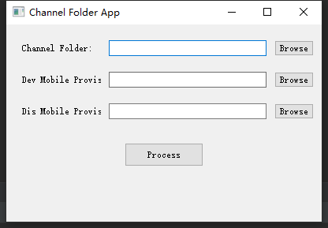

# ChannelFolderApp
这个库是用来提取mobileprovision信息的，提取我们的mobileprovision里面的UUID，TeamName，TeamIdentifier，Name，解决自动化打包ipa的配置相关信息。



- Channel Folder：选择我们的需要导出配置的文件夹
- Dev Mobile Provision：开发描述文件路径dev.mobileprovision
- Dis Mobile Provision：发布描述文件路径dis.mobileprovision
- Process：生成我们的配置文件

最终我们生成的效果配置

```ini
[debug]
CODE_SIGN_IDENTITY=Shenzhen Bingchuan Network Co., Ltd.
PROVISIONING_PROFILE=51fc78b9-631e-4fd5-8ba7-a97f3130c0be
PROVISIONING_PROFILE_SPECIFIER=tjcs_dev230809
DEVELOPMENT_TEAM=['F8938342U8']

[release]
CODE_SIGN_IDENTITY=Shenzhen Bingchuan Network Co., Ltd.
PROVISIONING_PROFILE=b9a19fe3-1a8a-47b1-9058-b5cfd9387e71
PROVISIONING_PROFILE_SPECIFIER=tjcs_dis230809
DEVELOPMENT_TEAM=['F8938342U8']
```

当然可以扩展成在这个上面的基础上配置一下其他东西。
